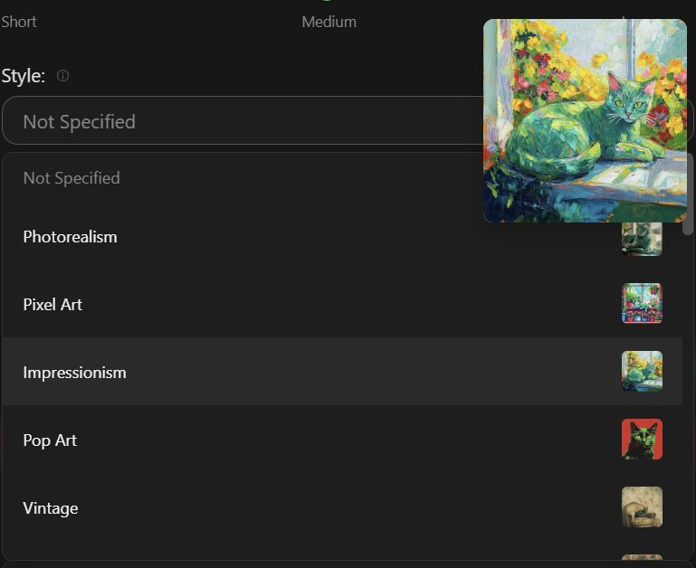
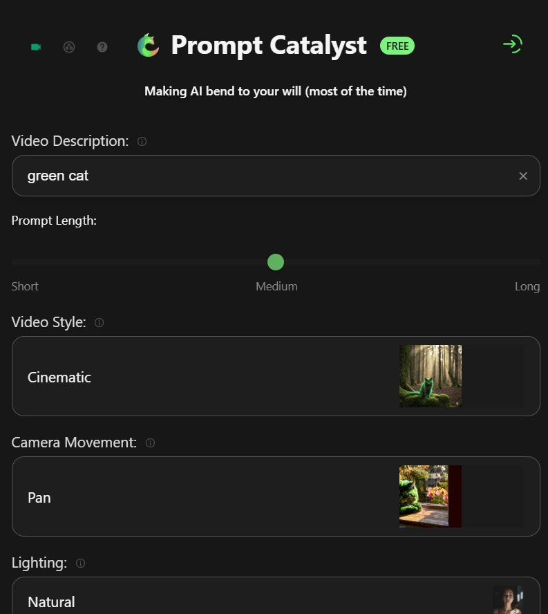
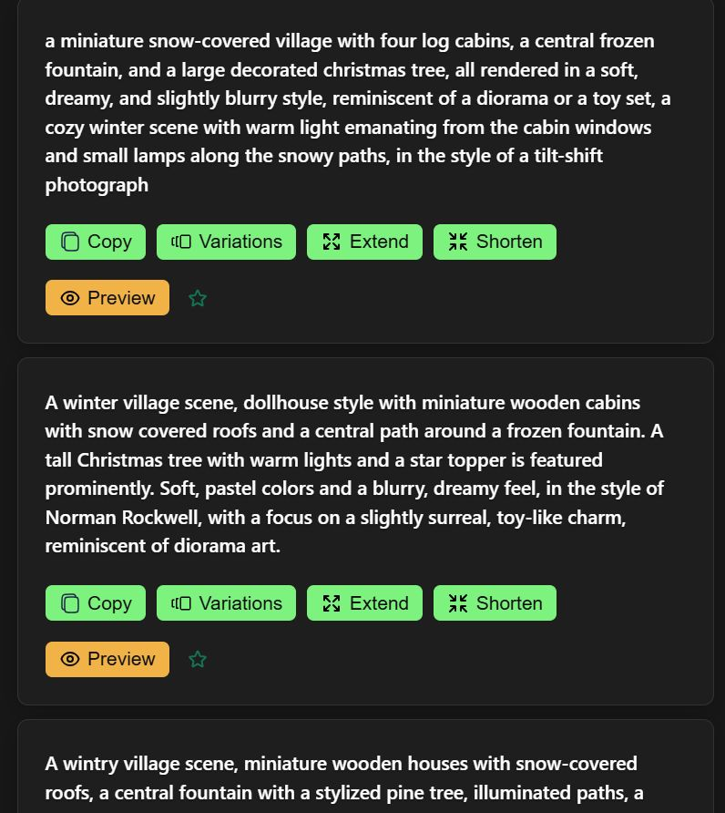
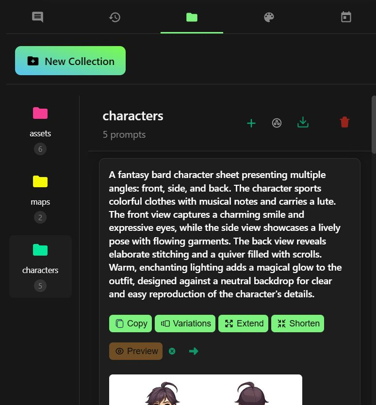

# Prompt Catalyst

A Chrome and Firefox extension for writing image and video prompts for Midjourney,
Flux, Stable Diffusion and DALL·E — style, lighting and camera controls, an
image-to-prompt analyser, inline preview generation, collections and history.

**[Chrome Web Store](https://chromewebstore.google.com/detail/prompt-catalyst/hehieakgdbakdajfpekgmfckplcjmgcf)** ·
**[Firefox Add-ons](https://addons.mozilla.org/en-US/firefox/addon/prompt-catalyst/)** ·
**[promptcatalyst.ai](https://promptcatalyst.ai)**

Live on both stores — ~2,400 users, 4.68★ on Chrome. Manifest V3, no build
framework, no runtime dependencies.


| | |
|---|---|
|  |  |
|  |  |

---

## Engineering notes

The interesting parts of this codebase, and why they are the way they are.

### Supabase auth without a bundler

The extension has no build step, and `@supabase/supabase-js` keeps its session in
`localStorage` — which a Manifest V3 service worker cannot read. So the four
GoTrue endpoints that are actually needed are called directly, and the session
lives in `chrome.storage.local`, the one store the popup and the worker share.

Losing the SDK also means losing its refresh timer, so
[`pc-auth.js`](scripts/pc-auth.js) refreshes on demand, immediately before a token
is handed out, and keeps that **single-flight**: Supabase rotates refresh tokens,
so two concurrent refreshes invalidate the pair and silently sign the user out.

### Refusals that mean what they say

Running out of credits is a `402` carrying a machine-readable `code`. It is not a
failure, and answering it with a retry produces a loop against an endpoint that
can only keep refusing — so [`pc-api.js`](scripts/pc-api.js) classifies it and
every call site asks one question: *can trying again change the answer?*

The web client treats `429` as a credit limit too, as a fallback for older
bundles. This deliberately does not: on this API a `429` is
`provider_rate_limited` — the generation service is briefly busy. Telling a
paying customer they are out of credits because a provider hiccuped is a lie, so
`429` is reported as transient. The old code guessed by searching the error text
for `"limit"`, which fired on *"Rate limit exceeded"* and missed refusals worded
any other way.

### One codebase, two browsers

Chrome runs the background as a service worker and loads the shared modules with
`importScripts`. Firefox runs it as an event page, which has no `importScripts`,
so its manifest lists the same files as `background.scripts` and `background.js`
guards the call. Two manifests, one source tree;
[`tools/build.js`](tools/build.js) substitutes the right one per target and strips
the `key` field from the Chrome upload.

### Identity recovered from the signed package

Google sign-in resolves against `https://<extension-id>.chromiumapp.org/`, so an
unpacked development build with a different ID than the published extension
authenticates fine locally and fails for every real user.

The fix is to pin the local ID to the published one, which means the published
extension's own public key. That was recovered from the signed CRX on the Web
Store. A CRX carries several signature proofs, and the publisher's is **not**
simply the first — it is the one whose SHA-256 matches `crx_id` in the header's
`signed_header_data`. Picking the first yields a plausible-looking but wrong ID;
the check that settles it is loading the extension and reading
`chrome.runtime.id`.

### A build that verifies itself

`node tools/build.js` produces both store packages, and refuses to produce a
broken one:

- **Every local reference must resolve inside the package.** `src`, `href` and
  `url()` across the packaged HTML, CSS and JS are checked against the files
  actually shipped. This caught a documentation page whose 28 embedded images had
  been excluded from the archive — a failure that builds cleanly, installs
  cleanly, and only shows up if someone opens that page.
- **The archive is written here rather than shelled out.**
  [`tools/zip.js`](tools/zip.js) is a small deflate writer over `zlib`, because
  PowerShell's `Compress-Archive` stores entry names with *backslash* separators
  on Windows. Chrome tolerates that; addons.mozilla.org rejects the upload
  outright. (Python's `zipfile` rewrites separators on read, so `namelist()`
  reports forward slashes for an archive that contains backslashes — only the raw
  bytes tell the truth.)

### Verified against the live API, not just built

Both packages were loaded unpacked and driven programmatically — Chrome over CDP,
Firefox over the remote debugging protocol — through sign-in, generation,
preview, variations, image analysis, credit exhaustion and sign-out, against the
real backend. Firefox installs with zero manifest warnings.

---

## Layout

```
manifest.json           Chrome (MV3). Carries `key`, pinning the published extension ID.
manifest.firefox.json   Firefox (MV3). Background scripts rather than a worker.
scripts/pc-config.js    Hosts and keys, in one place.
scripts/pc-auth.js      The Supabase session: sign in/up/out, Google, refresh.
scripts/pc-api.js       Request helper and error classification.
scripts/background.js   Service worker (Chrome) / event page (Firefox).
scripts/popup.js        The extension UI.
tools/build.js          Produces and verifies the store packages.
tools/zip.js            Spec-correct ZIP writer.
docs/ARCHITECTURE.md    How the pieces fit, and the decisions behind them.
```

`popup.js` is a large single file inherited from the original build — everything
runs inside one `DOMContentLoaded` closure, so splitting it changes what each
function closes over. Rather than rewrite a working UI used by thousands of
people, the backend migration was done by introducing the three focused modules
above and routing every call site through them. `docs/ARCHITECTURE.md` covers the
approach.

## Build

```bash
node tools/build.js
```

Writes `dist/chrome/` and `dist/firefox/` plus a zip of each. No dependencies —
Node only.

## Load it locally

**Chrome** — `chrome://extensions` → Developer mode → Load unpacked → this folder.
It loads under the published extension ID, which is what makes Google sign-in work
in development exactly as it does in production. (Recent Chrome has removed
`--load-extension`, so command-line loading needs Chrome for Testing.)

**Firefox** — build first, then `about:debugging` → This Firefox → Load Temporary
Add-on → `dist/firefox/manifest.json`.

## License

All rights reserved. This repository is published to show how the extension is
built; it is not licensed for reuse or redistribution. See [LICENSE](LICENSE).
